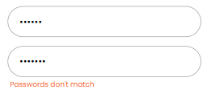

# Believe Fitness 
Nadia Lützhøft, WU13

Believe Fitness er en webapplikation for et fitness center, hvor medlemmer kan tilmelde sig hold og instruktører (admin) kan se alle tilmeldte medlemmer til de pågældende hold, og derudover oprette og administrere hold. Appen henter informationer fra et eksternt REST API.


## Tech stack

- **Next.js**
– Jeg valgte Next.js fordi det giver mig filbaseret routing via App Router og mulighed for API-routes, uden at jeg selv skal sætte en backend op. Jeg bruger en API-route (`/api/bf/[...path]`) som proxy til det eksterne API, så tokens ikke vises i browseren.

- **React**
– Jeg bruger React's `useState` til at styre formstate, fejlbeskeder og loading-tilstand. `useRouter` håndterer
navigation efter succesfulde handlinger, og `useEffect` bruges til at hente data fra API'et, når en side loader.

- **Zod**
– Jeg ville have ét sted, der validerer input og giver brugbare fejlbeskeder,
så jeg ikke selv er nødt til at skrive en masse betingede sætninger.
Zod kører klientside inden data sendes til API'et, og med `z.coerce.number()` håndterer jeg at formdata
altid ankommer som strings, selvom feltet skal være et tal.

- **SASS** 
– Jeg valgte SASS frem for f.eks. Tailwind, fordi jeg finder det mere overskueligt at arbejde med og har mest erfaring 
med det. SASS moduler sikrer også at mine klasser ikke skaber konflikter på tværs af komponenter, og `_tokens.scss` samler alle variabler ét sted. Det giver også en mere clean kode, i stedet for uendelige lange elementer med inline tailwind styling. 

- **Believe Fitness API**
– Eksternt REST API som leverer data om hold, trænere og brugere. Al kommunikation med API'et sker gennem min egen API-route proxy, så API-nøgler og tokens aldrig eksponeres direkte i browseren.


## Kodeeksempel

Jeg har valgt `SignupPage` som eksempel, fordi den har lidt af det hele:
klientside formhåndtering, Zod-validering og API-kald med fejlhåndtering.

### Sådan fungerer det

Når en bruger åbner signup-siden, møder de en formular med fire felter: navn, email, password og gentag password.


Inden formularen overhovedet kontakter API'et, tjekker siden om det brugeren har skrevet giver mening. Det sker via Zod-skemaet. Prøver brugeren at indsende med et forkert email-format, et password der er for kort, eller to passwords der ikke matcher, stopper siden op og viser en fejlbesked direkte under det relevante felt — uden at der bliver lavet et API-kald.



Er alt korrekt, sendes en POST-request til API'et med brugerens data. Lykkes det, logges brugeren automatisk ind og sendes videre til forsiden. Går det galt på API-siden, vises en generel fejlbesked øverst i formularen.

```javascript
"use client"

import { useState } from "react"
import { useRouter } from "next/navigation"
import { useNav } from "@/components/nav/NavContext"
import { signupSchema } from "@/lib/schemas"
import { bfFetch } from "@/lib/api"
import Brand from "@/components/Brand"
import BurgerBtn from "@/components/nav/BurgerBtn"
import styles from "./signup.module.scss"

export default function SignupPage() {
  const { login } = useNav()
  const router = useRouter()
  const [errors, setErrors] = useState({})
  const [serverError, setServerError] = useState(null)
  const [isPending, setIsPending] = useState(false)

  async function handleSubmit(e) {
    e.preventDefault()
    const result = signupSchema.safeParse({
      name: e.target.name.value,
      email: e.target.email.value,
      password: e.target.password.value,
      repeatPassword: e.target.repeatPassword.value,
    })

    if (!result.success) {
      setErrors(result.error.flatten().fieldErrors)
      return
    }

    setErrors({})
    setServerError(null)
    setIsPending(true)

    const { name, email, password } = result.data
    const res = await bfFetch("/api/v1/users", {
      method: "POST",
      headers: { "Content-Type": "application/x-www-form-urlencoded" },
      body: new URLSearchParams({ username: email, password }).toString(),
    })

    if (!res.ok) {
      setIsPending(false)
      setServerError("Something went wrong. Please try again.")
      return
    }

    await login(email, password)
    localStorage.setItem("displayName", name.trim())
    router.push("/")
  }

  return (
    <main className={styles.page}>
      <BurgerBtn className={styles.burgerBtn} />
      <Brand className={styles.brand} />
      <form className={styles.form} onSubmit={handleSubmit}>
        <h2 className={styles.heading}>Sign up as a new user</h2>

        <div className={styles.field}>
          <input className={styles.input} type="text" name="name" placeholder="Enter your name..." />
          {errors.name && <p className={styles.error}>{errors.name[0]}</p>}
        </div>

        <div className={styles.field}>
          <input className={styles.input} type="email" name="email" placeholder="Enter your email..." />
          {errors.email && <p className={styles.error}>{errors.email[0]}</p>}
        </div>

        <div className={styles.field}>
          <input className={styles.input} type="password" name="password" placeholder="Enter your password..." />
          {errors.password && <p className={styles.error}>{errors.password[0]}</p>}
        </div>

        <div className={styles.field}>
          <input className={styles.input} type="password" name="repeatPassword" placeholder="Repeat your password..." />
          {errors.repeatPassword && <p className={styles.error}>{errors.repeatPassword[0]}</p>}
        </div>

        {serverError && <p className={styles.error}>{serverError}</p>}

        <button className={styles.btn} type="submit" disabled={isPending}>
          {isPending ? "Signing up..." : "Sign up"}
        </button>
      </form>
    </main>
  )
}
```

## Beskrivelse af koden

`SignupPage` er markeret med `"use client"` øverst, fordi den bruger React state og lytter på brugerinteraktion direkte i browseren.

Til state bruger siden: `errors` fra Zod, `serverError` til fejl fra API'et, og `isPending` til at disable knappen mens der ventes på svar — så brugeren ikke kan trykke to gange.

Når formularen sendes, samler `handleSubmit` de fire værdier fra felterne og sender dem til `signupSchema.safeParse()`. Returnerer Zod fejl, opdateres `errors`-state og funktionen stopper — intet API-kald sker. Er alt gyldigt, nulstilles fejlene og `isPending` sættes til `true`.

Derefter bygges request-body'en som `URLSearchParams` (det format API'et forventer) og sendes via `bfFetch`. Er svaret ikke `ok`, vises en serverfejl og `isPending` sættes tilbage til `false`. Lykkes det, køres `login()` fra `NavContext` — som gemmer token og opdaterer login-state globalt.

Da API'et ikke understøtter at gemme brugerens navn ved oprettelse, gemmes navnet i stedet i `localStorage` under nøglen `displayName`. Profilsiden læser denne værdi som fallback, når API'et ikke returnerer et navn. Til sidst sendes brugeren videre til forsiden med `router.push("/")`.


## Ekstraopgave 

### Opgave B - Opret bruger

Da vi tidligere har arbejdet med "Create new user", valgte jeg denne ekstra opgave. Nedenfor ses det Zod-schema, der bruges i `SignupPage` til at validere brugerens input — herunder at de to passwords matcher, før der sendes data til API'et.

```javascript
export const signupSchema = z.object({
  name: z.string().min(1, "Name is required"),
  email: z.email("Invalid email"),
  password: z.string().min(6, "Password must be at least 6 characters"),
  repeatPassword: z.string().min(1, "Please repeat your password"),
}).refine((data) => data.password === data.repeatPassword, {
  message: "Passwords don't match",
  path: ["repeatPassword"],
})
```

### Opgave C - Opret, rediger og slet en "class"

Jeg valgte også at implementere denne funktion, da vi har prøvet lignende opgaver tidligere, og jeg følte mig nogenlunde sikker i at kunne få det til at fungere inden for deadlinen.

Admins kan oprette nye hold via en formular, der valideres med `createClassSchema` og sender data til API'et. Hvert hold kan også slettes direkte fra profilsiden. Redigering er implementeret som en separat side (`/classes/[id]/edit`), der henter det eksisterende holds data og sender en PUT-request med de opdaterede data.


## Perspektivering

Undervejs kæmpede jeg med at finde de rigtige data fra API'et, f.eks. alder på medlemmer 
og fandt aldrig ud af, om det havde gemt sig et hemmeligt sted eller om opgaven krævede 
at man hardcode'de medlemmers alder. Det endte jeg så med at gøre.

Noget af det sværeste i projektet var at finde ud af, hvordan det eksterne API forventede data. 

Hvis projektet skulle videreudvikles, ville jeg kigge på:

- **Billedoptimering** — billeder vises med ``, men Next.js's `<Image>`-komponent giver lazy loading og automatisk størrelsesjustering.
- **Bedre API-fejlbeskeder** — den eksterne API returnerer generiske 500-fejl uden forklaring, hvilket gør fejlfinding svær. Et mere robust API ville returnere strukturerede fejlbeskeder.
- **Tests** — projektet har ingen automatiserede tests. Unit tests på Zod-skemaerne og integrationstests på API-kaldene ville gøre det tryggere at ændre i koden fremover.