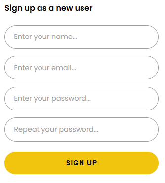
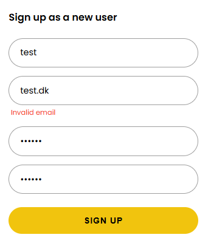
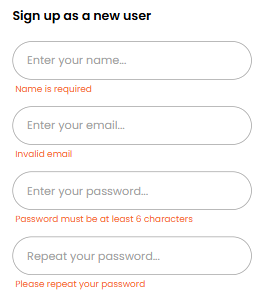
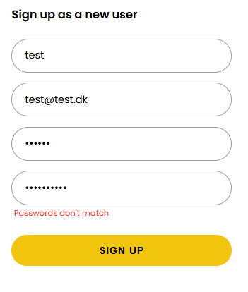

# Believe Fitness 
Nadia Lützhøft, WU13

Believe Fitness er en webapplikation for et fitness center, hvor medlemmer kan tilmelde sig hold <br>
og instruktører (admin) kan se alle tilmeldte medlemmer til de pågældende hold, og derudover oprette og administrere hold.<br> 
Appen henter informationer fra et eksternt REST API.


## Tech stack

- **Next.js**
– Jeg valgte Next.js fordi det giver routing via App Router og mulighed for API-routes, uden at jeg selv skal sætte en backend op. <br> 
Jeg bruger en API-route (/api/bf/[...path]) som proxy til det eksterne API, så tokens ikke vises i browseren. <br>
I Next.js bruger jeg React-hooks som useState til at styre formstate, fejlbeskeder og loading-tilstand, useEffect til at hente data når en side loader,<br> 
og useRouter til navigation efter login, oprettelse og lignende.

- **Zod**
– Zod samler al validering ét sted og giver brugbare fejlbeskeder uden at jeg selv skal skrive en masse if-checks. <br>
Med z.coerce.number() håndterer jeg at formdata altid ankommer som strings, selvom feltet — som f.eks. maxParticipants — skal være et tal.

- **SASS**
– Jeg valgte SASS frem for f.eks. Tailwind, fordi jeg finder det mere overskueligt at arbejde med og har mest erfaring med det. <br>
SASS-moduler sikrer at mine klasser ikke skaber konflikter på tværs af komponenter, og _tokens.scss samler alle variabler ét sted.

- **Believe Fitness API**
– Eksternt REST API som leverer data om hold, trænere og brugere.


## Kodeeksempel

Jeg har valgt SignupPage som eksempel, fordi den har lidt af det hele:<br>
klientside formhåndtering, Zod-validering og API-kald med fejlhåndtering.

### Sådan fungerer det

Når en bruger åbner signup-siden, er der en formular med fire felter: <br>
navn, email, password og gentag password.



Inden formularen overhovedet kalder API'et, validerer Zod om input'et er korrekt. <br>
Prøver brugeren at indsende med et forkert email-format, kommer en custom error besked,<br>
fordi formularen bruger `noValidate`.



Hvis der er generelle fejl, stopper siden og viser en fejlbesked direkte under det relevante felt, inden der bliver lavet et API-kald.




Hvis brugerens passwords ikke matcher, kommer der også en fejlbesked.




Er alt korrekt, sendes et POST-request til API'et med brugerens data. <br>
Lykkes det, logges brugeren automatisk ind og sendes videre til forsiden. <br>
Går det galt på API-siden, bliver der vist en fejlbesked nederst i formularen.


```javascript
"use client"

import { useState } from "react"
import { useRouter } from "next/navigation"
import { useNav } from "@/components/nav/NavContext"
import { signupSchema } from "@/lib/schemas"
import { bfFetch } from "@/lib/api"
import Brand from "@/components/Brand"
import BurgerBtn from "@/components/nav/BurgerBtn"
import styles from "./signup.module.scss"

export default function SignupPage() {
  const { login } = useNav()
  const router = useRouter()
  const [errors, setErrors] = useState({})
  const [serverError, setServerError] = useState(null)
  const [isPending, setIsPending] = useState(false)

  async function handleSubmit(e) {
    e.preventDefault()
    const result = signupSchema.safeParse({
      name: e.target.name.value,
      email: e.target.email.value,
      password: e.target.password.value,
      repeatPassword: e.target.repeatPassword.value,
    })

    if (!result.success) {
      setErrors(result.error.flatten().fieldErrors)
      return
    }

    setErrors({})
    setServerError(null)
    setIsPending(true)

    const { name, email, password } = result.data
    const res = await bfFetch("/api/v1/users", {
      method: "POST",
      headers: { "Content-Type": "application/x-www-form-urlencoded" },
      body: new URLSearchParams({ username: email, password }).toString(),
    })

    if (!res.ok) {
      setIsPending(false)
      setServerError("Something went wrong. Please try again.")
      return
    }

    await login(email, password)
    localStorage.setItem("displayName", name.trim())
    router.push("/")
  }

  return (
    <main className={styles.page}>
      <BurgerBtn className={styles.burgerBtn} />
      <Brand className={styles.brand} />
      <form className={styles.form} onSubmit={handleSubmit} noValidate>
        <h2 className={styles.heading}>Sign up as a new user</h2>

        <div className={styles.field}>
          <input
            className={styles.input}
            type="text"
            name="name"
            placeholder="Enter your name..."/>
          {errors.name && <p className={styles.error}>{errors.name[0]}</p>}
        </div>

        <div className={styles.field}>
          <input
            className={styles.input}
            type="email"
            name="email"
            placeholder="Enter your email..."/>
          {errors.email && <p className={styles.error}>{errors.email[0]}</p>}
        </div>

        <div className={styles.field}>
          <input
            className={styles.input}
            type="password"
            name="password"
            placeholder="Enter your password..."/>
          {errors.password && <p className={styles.error}>{errors.password[0]}</p>}
        </div>

        <div className={styles.field}>
          <input
            className={styles.input}
            type="password"
            name="repeatPassword"
            placeholder="Repeat your password..."/>
          {errors.repeatPassword && <p className={styles.error}>{errors.repeatPassword[0]}</p>}
        </div>

        {serverError && <p className={styles.error}>{serverError}</p>}

        <button className={styles.btn} type="submit" disabled={isPending}>
          {isPending ? "Signing up..." : "Sign up"}
        </button>
      </form>
    </main>
  )
}
```


## Beskrivelse af koden

`SignupPage` er markeret med `"use client"` øverst, fordi den bruger React state<br>
og lytter efter interaktioner fra brugeren direkte i browseren.

Til state bruger siden: `errors` fra Zod, `serverError` til fejl fra API'et, <br>
og `isPending` til at disable knappen mens der ventes på svar, <br>
så brugeren ikke kan trykke to gange.
Når formularen sendes, tager `handleSubmit` de fire værdier fra felterne <br>
og sender dem til `signupSchema.safeParse()`.

Jeg bruger `safeParse()` frem for `parse()`, fordi `safeParse` ikke crasher ved ugyldigt input, <br>
den returnerer i stedet et objekt med `success: true` eller `false`, <br>
så man selv kan håndtere fejlen uden at skulle pakke det ind i en `try/catch`.

Det er et bevidst valg at validere klientside først, fordi fejl bliver opdaget med det samme,<br>
uden at der overhovedet sendes en request.<br>
Er der fejl, opdateres `errors`-state og funktionen stopper. <br>
Er alt gyldigt, nulstilles fejlene og `isPending` sættes til `true`.

Formularen har `noValidate`, hvilket forhindrer browserens validering i at køre. <br>
Uden det ville browseren vise sine egne fejlbeskeder, før Zod overhovedet nåede at validere<br>
og derfor ødelægge den brugerdefinerede fejlvisning.

Derefter sendes dataen via `bfFetch`. Går det galt, vises en serverfejl<br>
og `isPending` sættes tilbage til `false`. Lykkes det, køres `login()` fra `NavContext`,<br>
som gemmer token og opdaterer login-state.

Da API'et ikke understøtter at gemme brugerens navn ved oprettelse, <br>
gemmes navnet i stedet i `localStorage` under nøglen `"displayName"`. <br>
Profilsiden læser denne værdi som fallback, når API'et ikke returnerer et navn.<br>
Til sidst sendes brugeren videre til forsiden med `router.push("/")`.


## Ekstraopgave 

### Opgave B - Opret bruger

Da vi tidligere har arbejdet med "Create new user", valgte jeg denne ekstra opgave.<br> 
Nedenfor ses det Zod-schema, der bruges i SignupPage til at validere brugerens input,<br>
herunder at de to passwords matcher, før der sendes data til API'et.

```javascript
export const signupSchema = z.object({
  name: z.string().min(1, "Name is required"),
  email: z.email("Invalid email"),
  password: z.string().min(6, "Password must be at least 6 characters"),
  repeatPassword: z.string().min(1, "Please repeat your password"),
}).refine((data) => data.password === data.repeatPassword, {
  message: "Passwords don't match",
  path: ["repeatPassword"],
})
```

.refine() bruges til at tilføje en ekstra valideringsregel, som ikke er indbygget i Zod,<br>
som i dette tilfælde om de to passwords er ens. path fortæller Zod,<br>
at fejlbeskeden skal knyttes til repeatPassword-feltet, så den dukker op det rigtige sted i formularen.

Er skemaet gyldigt, sendes et POST-request til /api/v1/users med email og password.<br> 
POST bruges fordi der bliver oprettet noget nyt. <br>
Lykkes det, logges brugeren automatisk ind og sendes videre til forsiden.


### Opgave C - Opret, rediger og slet en "class"

Jeg valgte også at implementere denne funktion, da vi har prøvet lignende opgaver tidligere, <br>
og jeg følte mig nogenlunde sikker i at kunne få det til at fungere inden for deadlinen.

Admins kan oprette nye hold via en formular, der valideres med createClassSchema <br>
og sender data til API'et. Hvert hold kan også slettes direkte fra profilsiden. <br>
Redigering er implementeret som en separat side (/classes/[id]/edit),<br>
der henter det eksisterende holds data og sender en PUT-request med de opdaterede data.


## Perspektivering

Noget af det sværeste i projektet var at finde ud af, hvordan det eksterne API forventede data. 

Undervejs kæmpede jeg med og brugte meget tid på at finde de rigtige data fra API'et,<br> 
f.eks. alder på medlemmer og fandt aldrig ud af, om det havde gemt sig et hemmeligt sted<br> 
eller om opgaven krævede at man hardcode'de medlemmers alder. <br>
Derudover når man befinder sig på "Sign Up", er der intet felt der kræver alder,<br> 
så en ny-oprettet bruger vil aldrig have en alder, derfor burde de predefinerede brugere i API'et <br>
heller ikke have det. Jeg har derfor udeladt alder, da det gav mest mening. 

Hvis projektet skulle videreudvikles og man skulle kigge på skalerbarheden, ville jeg muligvis overveje:

- **Billedoptimering** — billeder vises med en almindelig img-tag frem for Next.js's Image-komponent, <br>
fordi Image kræver at man på forhånd whitelister eksterne billeddomæner i next.config.js,<br>
hvilket ikke er praktisk når billederne kommer fra et API man ikke selv kontrollerer.
- **Bedre API-fejlbeskeder** — det eksterne API returnerer generiske 500-fejl uden forklaring,<br> 
hvilket gør fejlfinding svær. Et mere robust API ville returnere strukturerede fejlbeskeder.
- **Loading states** — mange sider viser ingenting mens data hentes fra API'et. <br>
Skeleton loaders ville måske være værd at overveje.
- **Delete participants** - det ville måske være en fordel at kunne slette brugere fra admin siden, <br>
eller en form for automatisering så holdene ikke er fyldt op med ikke-aktive brugere.  


## Opsummering


Alt i alt var projektet sjovt, men udfordrende. <br>
At arbejde med et eksternt API man ikke selv kontrollerer kræver en del tilpasning undervejs,<br> 
og man lærer at designe sin kode så den kan håndtere manglende eller uventet data.

Jeg er umiddelbart tilfreds med resultatet. Appen indeholder de vigtigste funktioner,<br>
 koden er overskuelig, og jeg har fået brugt de teknologier jeg satte mig for fra starten.